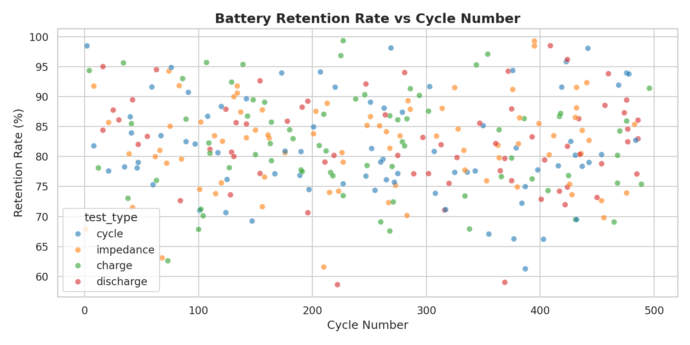
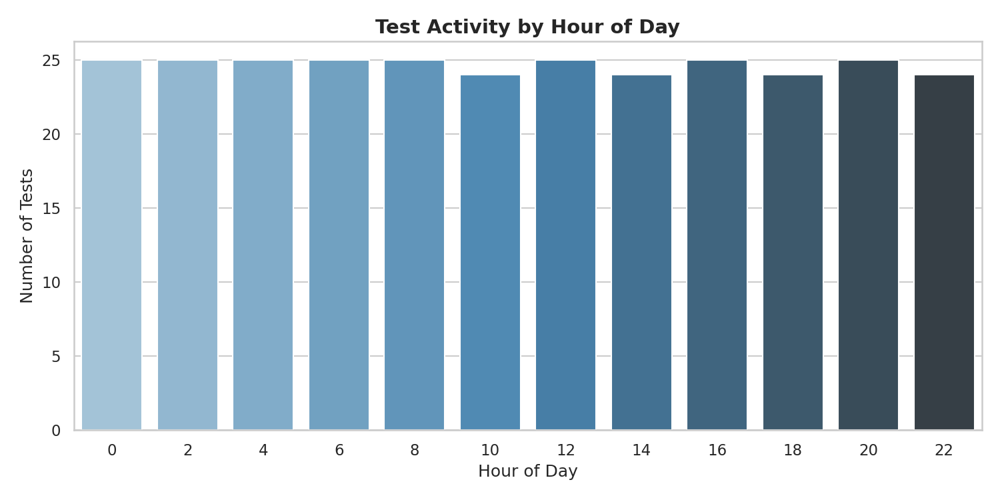
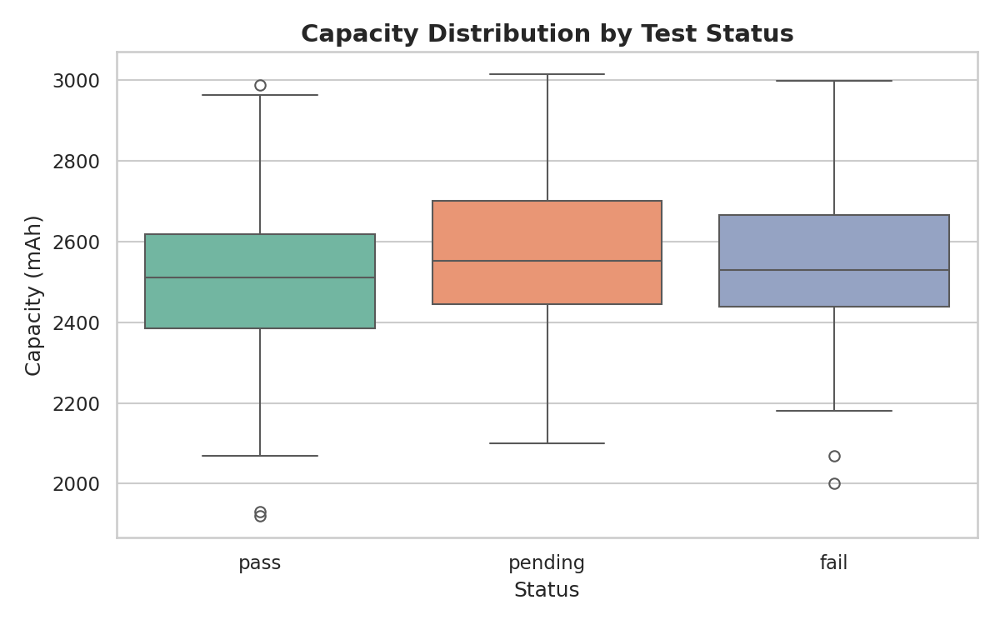

# Battery Data Analytics Pipeline

Automated data engineering pipeline for processing experimental battery test datasets,
built during internship at ARCI, Hyderabad.

## Overview
- Processes 300 Lithium-Sulfur (Li-S) cell cycling records across charge, discharge, cycle, and impedance test types
- Handles missing sensor readings, removes physically impossible voltage/temperature outliers, and engineers time-based features (hour, day, duration category)
- Loads structured data into a normalized SQLite database with relational schema
- Runs SQL aggregations to surface capacity fade trends, pass/fail rates, and overutilized cell identification
- Produces matplotlib/seaborn visualizations for retention degradation, peak test hours, and capacity distribution by status

## Tech Stack

Python · Pandas · NumPy · SQLite · Matplotlib · Seaborn

## Project Structure

```
battery-data-analytics/
├── data/
│   ├── raw/               # original CSV input (300 records)
│   └── cleaned/           # pipeline output (296 records after cleaning)
├── pipeline/
│   └── data_pipeline.py   # cleaning, transformation, feature engineering
├── database/
│   ├── schema.sql         # relational table definitions
│   └── load_data.py       # loads cleaned CSV into SQLite
├── analysis/
│   ├── sql_analysis.py    # aggregation queries, pass/fail rates, overutilization
│   └── eda.py             # matplotlib/seaborn charts
├── outputs/               # generated PNG charts
├── requirements.txt
└── README.md
```

## How to Run

```bash
pip install -r requirements.txt
python pipeline/data_pipeline.py
python database/load_data.py
python analysis/sql_analysis.py
python analysis/eda.py
```

## Key Insights

- **72.3% pass rate** across 296 cleaned test records; 12.8% fail, 14.9% pending
- **All 20 batteries** flagged as overutilized (400+ cycles), with peak at 496 cycles (BAT_020)
- **82% average retention rate** maintained across all test types (charge, discharge, cycle, impedance)
- **Discharge tests** yielded the highest average retention (82.37%), cycles the lowest (81.61%)
- Testing activity peaks evenly across hours 6, 8, 12, 16, 20 — no single bottleneck hour
- Pipeline removes outliers outside voltage [2.5–4.5V], temperature [0–60°C], retention [0–100%]
- Schema designed to extend into ML prediction workflows (cycle degradation forecasting)

## Sample Outputs

### Retention Rate vs Cycle Number


### Peak Testing Hours


### Capacity Distribution by Test Status

